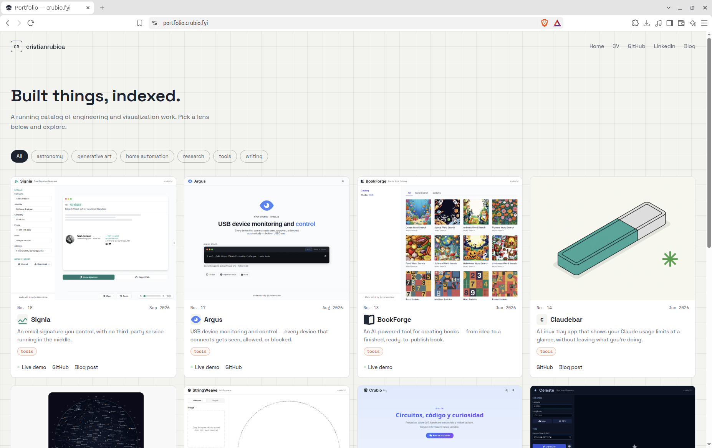

# Portfolio

[](https://astro.build)
[](https://nodejs.org)
[](LICENSE)

Personal portfolio site built with [Astro](https://astro.build).

🔗 [portfolio.crubio.fyi](https://portfolio.crubio.fyi)



## Development

```bash
npm install
npm run dev
```

## Project thumbnails

Capture a project's thumbnail at a fixed viewport (local-only, not run in CI):

```bash
npm run screenshot -- <project-folder> <url> [--hero]
```

Example:

```bash
npm run screenshot -- 08-stringweave https://stringweave.crubio.fyi --hero
```

Saves to `src/content/projects/<project-folder>/thumbnail.png`.

## License

MIT — the code is free to reuse. The content (projects, text, images) is personal; replace it with your own before reusing this as a template.
